# Final Report
### Emily Martin | Spring 2021 | eem80@pitt.edu

### Introduction
#### Summary
The goal of this project was to analysis newspaper articles from 2015 during the refugee crisis in Germany. Specifically, I wanted to look at several sources with different political leanings and compare their sentiments towards refugees. I scraped articles from four different sources and then used SpaCy, along with their Sentiws pipeline extension, to perform sentiment analysis on them. I also did some analysis of the sentiment analysis method itself, shortcomings and potential improvements, as well as some word-based analysis of the sources.
#### Background/Motivation
The Flüchtlingskrise, or the refugee crisis, refers to the period of time ~2015-2016/17 when hundreds of thousands of refugees from the Middle East and Africa flooded into Europe escaping violence and war. Many came over land, into Turkey and Greece while many also braved the Mediterranean Sea, into Italy. Because these countries alone could not take all the asylum seekers many EU countries decided to accept a certain number. Germany in particular took on a huge number of people, a move that was controversial then and continued to spark debates up until the present. In particular some of the rise and popularization of very conservative/extreme-right/nationalistic groups, such as the AfD (Alternative für Deustchland, a very conservative, "Germany for the Germans" kind of party) and PEGIDA (Patriotische Europäer gegen die Islamisierung des Abendlandes/Patriotic Europeans Against the Islamicisation of the Occident) can be traced back to the refugee crisis. This is not to say that the reaction in Germany was not all negative, there was a big push for a "Welcome culture" and many people volunteered to help in all sorts of ways. I was one of them in 2017 when I taught English at a high school and that was a big part of my motivation for this project.
#### Hypothesis
Because right-wing politics tend to be much more anti-immigration my hypothesis was that more right-leaning newspapers would report on the refugees more negatively than those that leaned more left. Conversely more left-leaning sources would express more positive sentiments towards refugees.

### Process
When I first began this project I did not know anything about web scraping and of the five original sources I chose only one (Der Zeit) supported an API. To my knowledge it is also just the only German newspaper that has one at all. Which leads me to the first big issue, which was copyright. None of these newspapers are keen on anyone sharing any data gathered, nor do they make it easy to tell if you can scrape the site at all. One source, FAZ (Frankfürter Allgemeine Zeitung) explicitly forbids web scraping of any kind. This is a shame because they were my middle/right source and so I was left with one very left (Die Tageszeitung), one middle left (Süddeutsche Zeitung), one more central, but still more left-leaning than right-leaning (Der Zeit) and then only one very right source (Junge Freiheit). The uneven distribution is not ideal, but at that point I just needed to get my data. Overall, data gathering took a lot longer than anticipated, up until the second progress report, which did not leave me nearly as much time as I wanted for analysis. Each site is structured differently, so even after learning how to scrape with Urllib and BeautifulSoup it was a process to adapt the code to each site. Later I also ran into the issue that the scraping scripts can be temperamental and in the case of Junge Freiheit the 'date filter' which is supposed to only allow articles from 2015 stopped working because of something on their end that I was not able to determine. Filtering once the data was in the dataframe proved easy enough, but it was still a disheartening discovery. I also had a problem with the Süddeutsche Zeitung script only getting articles for the first three months of 2015 (I think the site limits each search to 100 pages) and I was able to fix this by sorting by relevance instead of date.

The second big issue came with Sentiws, the SpaCy pipeline extension for German sentiment analysis. It assigns certain words weights (-1 to 1) which can then be used to calculate a total sentiment score. However, very few words actually have weights and Flüchtling, my search term, has a negative weight. Not only does that not jibe with both my knowledge of the word, but native German speakers have assured me it is not innately negative - if anything the opposite. Not only was Flüchtling negative, but the majority of my articles were labeled negative as well. While there was no quick fix that worked, I tried removing 'Flüchtling' as well as a more refined labeling scheme, I was able to do a deeper dive into the most common words and their scores and determine some potential explanations. I had originally also hoped to include some analysis of tense used, however I did not have  time in the end.

### Data
An overview of my data and how I got it:

- [Der Zeit](https://www.zeit.de/index?utm_referrer=https%3A%2F%2Fwww.google.com), centrist/liberal in its political leanings, was the first site that I scraped and they kindly support and API. Through the API I was able to enter a search term and collect article links, which I was then able to iterate through with urllib and BeautifulSoup to get the article text. Here is a link to the [nbviewer version](https://nbviewer.jupyter.org/github/Data-Science-for-Linguists-2021/Fluechtlingskrise-Sentiment-Analysis/blob/main/scraping/zeit.ipynb) of my Zeit scraping script. In the end I was able to collect 573 articles.

- [taz.ipynb](https://github.com/Data-Science-for-Linguists-2021/Fluechtlingskrise-Sentiment-Analysis/blob/main/scraping/taz.ipynb), which leans left-wing/green and is the most liberal of my sources was the next site I scraped. This one required me to manually collect links through Pitts archive, which was quite time consuming, and so I was only able to get 100 links. I iterated through them in a similar manner to the Zeit links and was able to populate a dataframe with dates and text, here is a link to the [nbviewer version](https://nbviewer.jupyter.org/github/Data-Science-for-Linguists-2021/Fluechtlingskrise-Sentiment-Analysis/blob/main/scraping/taz.ipynb). In the end I was able to get 100 articles.

- [Der Süddeutsche Zeitung](https://www.sueddeutsche.de), which leans left-liberal was my next stop, and this one required two scraping steps. First I scraped urls for relevant articles using their base url and a nifty add on url chunk that included: search string/date range/sort by relevance (very kind of them to make it so simple), which I then iterated though to get the article text. Here is a link to the [nbviewer version](https://nbviewer.jupyter.org/github/Data-Science-for-Linguists-2021/Fluechtlingskrise-Sentiment-Analysis/blob/main/scraping/Süddeutsche_zeitung.ipynb) of the script. In the end I was able to get 990 articles. By far the most for any source!

- [Junge Freiheit](https://jungefreiheit.de), which leans fairly far right, was my last stop. This site did not kindly include a date range in the url so I had to write the first scraping code (that collected to article links) to filter by date. As I mentioned above this stopped working perfectly for reasons I could not determine, however I was still able to sort by date once the dataframe was built. Here is the [nbviewer version](https://nbviewer.jupyter.org/github/Data-Science-for-Linguists-2021/Fluechtlingskrise-Sentiment-Analysis/blob/main/scraping/Junge_Freiheit.ipynb) of the script. In the end I got 76 articles. The fewest of any source, but they are a fairly small weekly newspaper.

### Analysis
#### First attempt
I began my [first analysis](https://nbviewer.jupyter.org/github/Data-Science-for-Linguists-2021/Fluechtlingskrise-Sentiment-Analysis/blob/main/Presentation.ipynb#Sentiment-Analysis) by building a SpaCy pipeline including Sentiws which I then passed all the text through, having it collect the sentiment scores when there was one. I then took the mean of the scores for each article and ran that through a custom function to give each article a 'pos' or 'neg' label.

Here is a plot of that first run!

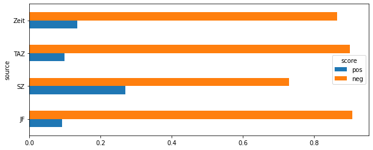

And here is another:

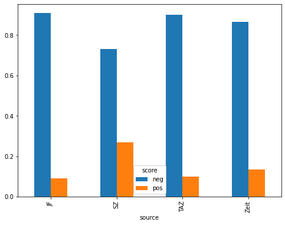

As these plots show all the sources had overwhelmingly more negative articles than positive articles and while Junge Freiheit does have the most negative articles, in support of my hypothesis, TAZ has the second most negative articles, in direct controversy with my hypothesis, as it is the most liberal source. After that Der Süddeutsche Zeitung having the most positive articles followed by Der Zeit does support my hypothesis.

I also charted sentiment over time for Zeit - it has the most even article distribution and all the other sources had some strangely formatted dates.

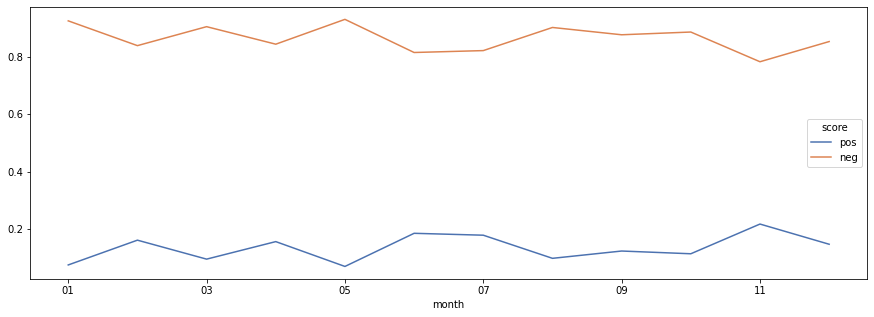

April was when everything really started to get crazy, so maybe the big dip in positivity in May is a slightly late reflection of that? It is clear however that sentiment constantly changes overtime, probably due to a complex set of factors including politics, events, the economy and public opinion among them.

### A deeper dive into Sentiws
It was already clear at this point that Sentiws is not a perfect tool and so for the rest of my time I decided to  take a [deeper dive](https://nbviewer.jupyter.org/github/Data-Science-for-Linguists-2021/Fluechtlingskrise-Sentiment-Analysis/blob/main/Presentation.ipynb#A-deeper-dive-into-Sentiws:-flaws,-function-and-attempts-at-improvement) into its function and see if I could not improve it, or at least understand what was going on.
#### First off: Flüchtling as a negative weight
Because Flüchtling has a negative weight and it appears in all my articles at least once I tried the  'quick fix' of [removing it](https://nbviewer.jupyter.org/github/Data-Science-for-Linguists-2021/Fluechtlingskrise-Sentiment-Analysis/blob/main/Presentation.ipynb#First-off:-Flüchtling-as-a-negative-weight) before collecting the weights from Sentiws to see if that made any difference to the overwhelmingly negative skewing of my articles.

Here is a plot of how that turned out:

If this image looks almost identical to the first, that is because almost nothing changed... TAZ gained no positive articles, Junge Freiheit gained one, Zeit gained 3 and Süddeutsche Zeitung gained 46 (actually not too shabby there). There are also 25 articles that have a score of None - which seems to indicate that Flüchtling was the only weighted word they contained.
#### More refined weights
Since removing Flüchtling did not have as big an impact as I was expecting I decided to try a [more refined labeling system](http://localhost:8888/notebooks/Documents/Data_Science/Fluechtlingskrise-Sentiment-Analysis/Presentation.ipynb#Second-attempt:-A-more-refined-labeling-scheme) by adding in 'very pos', 'very neg' and 'neut'. I decided my scale by eyeballing the data and seeing the most common range of the scores and decided upon .199/-.199 as my 'very pos'/'very neg' cut off. The fact that the negative scores are overall more negative than the positive scores are positive meant the range had to be a bit more narrow than I would have liked.

Here is that plot:

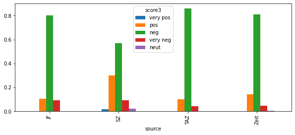

As illustrated here, there is still an overwhelming number of pos/neg articles, with only Süddeutsche Zeitung having any 'very pos' articles at all. Even though the score distribution is so concentrated in the .199/-.199 range I did not want to shrink it any more because there are articles with possible scores far outside that range and condensing it any more felt like gaming the system. However, I feel that this is still a more informative result than before.

#### A quick aside
Since so few words have weights and an articles sentiment can be determined by as little as one word I decided to [check](https://nbviewer.jupyter.org/github/Data-Science-for-Linguists-2021/Fluechtlingskrise-Sentiment-Analysis/blob/main/Presentation.ipynb#A-brief-side-step) if the overall trend of overwhelmingly negativity stayed true for all articles with 20 weighted words or more. There were 791 of these, and here is a plot that shows their sentiments:

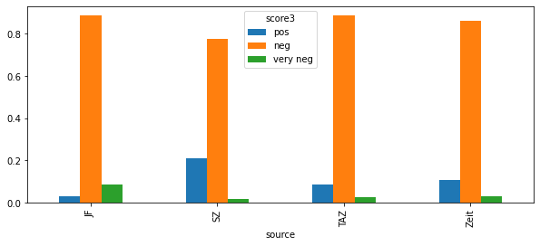

As this plot shows the trend certainly does stay the same for these articles, so the negative trend must be because of something else.

### Word-based Analysis
At this point it was becoming clear that there was nothing much I could do in the time to drastically improve Sentiws, as negation analysis or anaphora resolution would have been too time consuming, so I decided to take a deeper look at the weighted words and compare them by source.
#### Weighted words
I [began](https://nbviewer.jupyter.org/github/Data-Science-for-Linguists-2021/Fluechtlingskrise-Sentiment-Analysis/blob/main/Presentation.ipynb#A-deeper-look-at-weighted-words) by looking at the most common weighted words by sentiment. Here are the wordclouds I generated:

Most common weighted words in the positive articles:

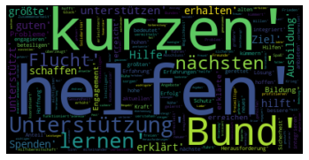

Most common weighted words in the negative articles:

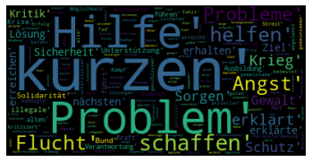

I also looked at all the words by sentiment, not only the weighted ones. Here are those wordclouds:

Most common overall words in the positive articles:

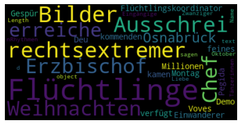

Most common overall words in the negative articles:

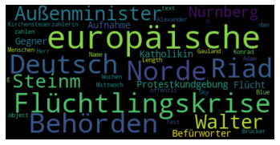

Clearly there is some overlap in the weighted words, as some negatively weighted words were in the positive articles and vice versa, kurzen (short), for instance, appears often in both. Between the weighted words and all words I actually think the differences between all the words are more illuminating. For example, refugees (Flüchtlinge) is in the positive words while refugee crisis (Flüchtlingskrise) is in the negative words. This could indicate that it is the crisis that is negative, not the refugees themselves. European (europäische), foreign minister (Aussenminister) and public authorities (Behörden) are all in the negative words as well, indicating that perhaps the political side is more negatively weighted than the personal. On another rather odd note, right-wing extremist (rechstextremer) is in the positive articles, as is PEGIDA, the alt-right group. Since  I doubt that even the right-wing newspaper would speak very positively of them, I wonder if refugees are portrayed more positively in comparison. If nothing else, it shows that the topics are indeed different between sentiments.

#### Word-based analysis by source
I then went on to do the [same process above on each source](https://nbviewer.jupyter.org/github/Data-Science-for-Linguists-2021/Fluechtlingskrise-Sentiment-Analysis/blob/main/Presentation.ipynb#Word-based-analysis-by-source) to compare their word use and the weighted words they contained. Overall my conclusion here is that given the subject matter there are simply going to be more negative words, it is a crisis after all, and so words like fear, war, problems and violence are going to appear often, regardless of how the article is speaking about them. This just highlights the need for a more delicate method, one that takes more than just the presence of words into account. However, there are still some interesting differences between the sources (for instance JF mentioned 'illegal' quite often in their negative articles and the only other source to do so was SZ in their very negative articles).

I made word clouds for each source by sentiment, with both weighted words and all words. That is an awful lot of wordclouds so I will not show them all here, they can be in [this section](https://nbviewer.jupyter.org/github/Data-Science-for-Linguists-2021/Fluechtlingskrise-Sentiment-Analysis/blob/main/Presentation.ipynb#Word-based-analysis-by-source) in the script and in my [images folder](https://github.com/Data-Science-for-Linguists-2021/Fluechtlingskrise-Sentiment-Analysis/tree/main/images). However, I will put some samples here.

Weighted words for the positive articles:

TAZ:

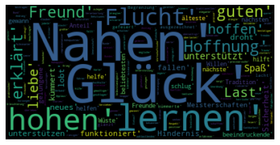

SZ:

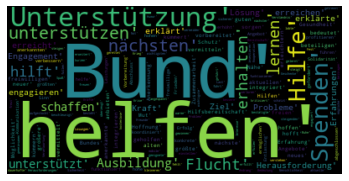

Zeit:

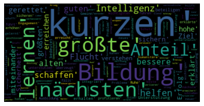

JF:

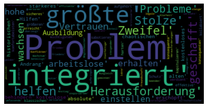

And weighted words for the negative articles:

TAZ:

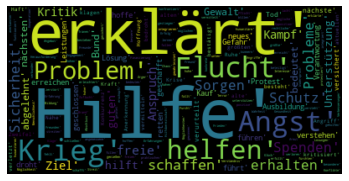

SZ:

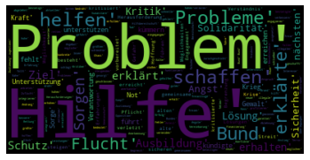

Zeit:

JF:

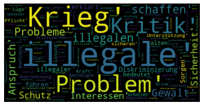

Here we can see that each source has different most common  weighted words, even though there is some overlap. This could indicate that they are indeed speaking differently about these topics, although there is not really enough evidence to definitively conclude that (they may just be talking about different things).

### Flüchtlingen Trigrams
My last little aside was to [look at trigrams](https://nbviewer.jupyter.org/github/Data-Science-for-Linguists-2021/Fluechtlingskrise-Sentiment-Analysis/blob/main/Presentation.ipynb?flush_cache=true#Trigrams:-one-last-exploration) containing the word refugee. The goal was to examine the words surrounding refugee, especially since it has a negative weight. However, the results were not as helpful as I would have liked and there was no real meaningful difference between trigrams in negative and positive articles.
### Conclusions
While in some ways the data fit my hypothesis (Junge Freiheit having the most negative articles), in others it did not. Also, because of the issues I found with Sentiws I do not feel confortable drawing any concrete conclusions regarding my hypothesis. Overall, it seems to me that Sentiws is simply not refined enough to make an absolute judgement about an articles sentiment because it uses such a naive approach. It was a good tool for beginning analysis but I think the next step would have to be something that takes more than word presence into account - such as negation analysis or anaphora resolution. I think my word-based analysis shows that there are definitely differences between the sources and what/how they are reporting on things and even more than that showed why the articles are all skewed so negatively: namely, that it is a crisis and therefore words like war and violence are going to be very prevalent. Despite the issues with Sentiws I think I was able to get a better sense of its shortcomings, knowledge that could be put towards improving this project or future projects, and with the word-based analysis I think I was able to provide some evidence of differences between the sources.

While there are many things I would do differently if I could do it again I am very happy with the way the project turned out in the end and I hope that others enjoy looking at my work as well :)
